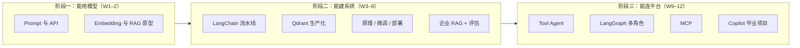

# AI Engineer 12 周学习路线

> 面向具备 **Python、SQL、Spark、Airflow、Databricks** 经验的数据工程师，目标是从「会用 API」到「能交付可运维的 Data Platform Copilot」。
>
> **主线能力：** 生成式 AI 基础 → RAG 与评估 → 向量库工程化 →（原理与部署）→ 企业级 RAG → Agent / LangGraph → MCP → 综合项目

## 目录

- [先决条件与环境](#先决条件与环境)
- [三阶段路线图](#三阶段路线图)
- [学习目标与节奏](#学习目标与节奏)
- [12 周总览](#12-周总览)
- [路径设计说明](#路径设计说明)
- [GitHub 参考路线与对标](#github-参考路线与对标)
  - [对标仓库清单（维护表）](#对标仓库清单维护表)
- [分周计划（Week 1–12）](#week-1生成式-ai-与-prompt-engineering)
- [毕业项目与周交付映射](#毕业项目与周交付映射)
- [学习优先级与时间分配](#学习优先级与时间分配)
- [每周复盘模板](#每周复盘模板)
- [官方资源收藏](#官方资源收藏)
- [AI 数据治理](#ai-数据治理)
- [职业能力路径](#职业能力路径)

---

## 先决条件与环境

### 技能先决条件

| 领域 | 期望水平 |
|---|---|
| Python | 能写模块、依赖管理、简单 async |
| SQL | 复杂查询、只读分析场景 |
| 数据平台 | 接触过 Airflow / Spark / 仓库表结构 / Runbook |
| Git | 分支、PR、`.env` 不入库 |
| 容器 | 能跑 `docker compose` |

### 环境清单（Week 1 前完成）

- Python 3.11+，推荐 `uv` 或 `poetry` 管理虚拟环境
- Docker Desktop（Week 4 起 Qdrant；Week 12 Compose 全栈）
- 至少一种 LLM 访问方式：**OpenAI / Azure OpenAI API**，或本机 **Ollama**（Week 7 前备好）
- 可选 GPU：Week 6 微调、Week 7 vLLM；无 GPU 可走文档中的**选修路径**
- 本仓库约定：每周代码放在 `weekNN-<topic>/`，根目录不放密钥

### 与现有工作的衔接

每周尽量用**真实但脱敏**的材料练手（Airflow 文档、内部规范摘要、表结构样例、故障 Runbook），这样 Week 8 与 Week 12 不是从零造场景，而是**把前几周作业升格为产品化**。

---

## 三阶段路线图



| 阶段 | 周次 | 结束时你能演示什么 |
|---|---|---|
| 一 | 1–2 | 3 个 Prompt 小工具 + 带引用的 PDF/文档问答 |
| 二 | 3–8 | Qdrant 上 1k+ 切片、可评估的企业知识库 API（Copilot V1） |
| 三 | 9–12 | 多工具 Agent、审批流、MCP 接 GitHub/文件/数据平台、Compose 一键启动 |

---

## 学习目标与节奏

完成本计划后，应具备：

- 使用云端或本地大模型开发生成式 AI 应用
- 理解 Prompt、Token、Embedding、Transformer 与 Attention（能讲清 RAG 里每一环在干什么）
- 独立构建**可评估**、带来源引用的 RAG 知识库（含 Hybrid / Rerank / 拒答）
- 使用 **Qdrant** 做语义检索、Payload 过滤与混合检索
- 使用 **Ollama** 或 **vLLM** 提供推理服务，并做基础压测
- 理解 SFT、LoRA、QLoRA（至少完成一次小规模实验或读懂训练配置）
- 使用 **LangGraph** 组织 Agent 与多 Agent 工作流（AutoGen / CrewAI 作对比阅读）
- 使用 **MCP** 连接文件系统、GitHub 与数据平台类工具
- 建立 AI 数据治理能力：知识、Chunk、Embedding、向量索引、权限、评估、Agent 与生命周期治理
- 交付一个可部署的 **Data Engineer Copilot**（含日志、测试、治理与审计）

### 建议投入

| 时间 | 建议 |
|---|---:|
| 工作日 | 每天 1–1.5 小时 |
| 周末 | 4–6 小时 |
| 每周 | **10–15 小时**（低于 8 小时请优先「必做」） |
| 总周期 | 12 周（约 **120–180** 小时） |

### 每周固定动作

1. 阅读当周**必做**课程（选做留到有余力或第二遍）
2. 跑通官方示例 → 改成本周作业目录下的代码
3. 写清 `weekNN-*/README.md`：怎么跑、依赖、已知问题
4. 提交 **`RESULTS.md`**（借鉴 [agent-prep](https://github.com/shaneliuyx/agent-prep)）：关键数字与结论，避免「感觉学会了」——例如 RAG 通过率、P95 延迟、召回样例、微调前后对比表
5. 用当周**验收标准**自测；RAG 相关周更新测试问题集
6. Git 提交到对应周目录（不提交密钥与原始敏感数据）

---

## 12 周总览

| 周 | 阶段 | 主题 | 必做交付 | 学时（参考） |
|---:|---|---|---|---:|
| 1 | 一 | LLM 与 Prompt | API 客户端 + 3 个助手 | 10–12 |
| 2 | 一 | Embedding 与 RAG 入门 | 多格式 RAG + Chunk 实验 | 12–15 |
| 3 | 二 | LangChain 与 RAG 工程化 | Airflow 文档助手（**接 Qdrant**） | 12–15 |
| 4 | 二 | Qdrant 向量库 | 1k+ Chunks、Filter、Hybrid | 10–12 |
| 5 | 二 | Transformer 原理 | 架构图 + Attention 代码 | 8–10 |
| 6 | 二 | LoRA 微调 | SQL 微调对比（**无 GPU 可选修**） | 10–15 |
| 7 | 二 | 模型部署 | Ollama / vLLM + 压测 | 10–12 |
| 8 | 二 | 企业级 RAG | Copilot V1 + Ragas 评估 | 15–18 |
| 9 | 三 | Agent 基础 | 多工具 + 护栏 | 12–14 |
| 10 | 三 | LangGraph | Data Engineer 多节点图 | 14–16 |
| 11 | 三 | MCP + AI 数据治理 | Data Catalog MCP + 治理清单 + 安全设计 | 14–16 |
| 12 | 三 | 毕业项目 | Data Engineer Copilot | 18–24 |

**核心课程来源（按周查阅详情）：** Microsoft GenAI / OpenAI Cookbook → LangChain + LLM Zoomcamp → Qdrant → LLM Course → LLaMA-Factory → Ollama/vLLM → LlamaIndex/Ragas → Microsoft AI Agents → LangGraph → MCP 官方文档。

---

## 路径设计说明

以下调整用于**减少返工、对齐数据工程场景**，周次编号不变，便于目录与习惯一致。

1. **Week 3 起向量库统一为 Qdrant**  
   不要在 Week 3 用临时内存向量库再在 Week 4 重写。直接复用 `week04-qdrant/docker-compose.yml`（可在 Week 3 先建目录与 compose），索引与检索 API 从 Week 3 就针对 Qdrant。

2. **Week 5 可与 Week 3–4 并行阅读**  
   不必等 Week 5 才做 RAG。最低要求：Week 2 后读 [The Illustrated Transformer](https://jalammar.github.io/illustrated-transformer/) 前半；Week 5 集中补 Attention 实现与笔记。Week 6 微调前需理解「下一 Token 预测」即可。

3. **评估从 Week 3 开始线程化**  
   Week 3 建立 `evaluation_questions.json`（≥20 题）；Week 8 扩展到 ≥30 题并接入 **Ragas**（或先手写「来源是否命中」规则）。避免 Week 8 才第一次测质量。

4. **Week 6 微调为选修加深**  
   时间紧或无机：精读 PEFT 文档 + 完成 `train_config.yaml` 与数据格式，用**已有 LoRA 权重**或云端 Notebook 跑 1 次短训练；必做项改为「前后对比表 + 能解释 rank/alpha」。

5. **Week 8 是 Week 3–4 的产品化，不是第二个 science project**  
    ingestion / retrieval 模块从周作业**迁移+加固**（增量、Hybrid、Rerank、拒答、API），不要另起一套目录结构。

6. **Agent 栈以 LangGraph 为主**  
   Week 9 理解 Tool / Memory / Agentic RAG；Week 10 用 LangGraph 实现审批与路由。AutoGen、CrewAI 各选 1 个官方 Quickstart 对比即可。

7. **可选：Databricks 对齐（与 NIKE/EDA 栈一致）**  
   - RAG 文档源：Unity Catalog 表说明、Job 说明、内部 Markdown  
   - 评估与追踪：MLflow Tracing / GenAI Evaluate（有 workspace 时替代部分手写评估表）  
   - MCP：表搜索、Job 运行状态、血缘查询与 Week 11 作业对齐  

8. **可观测性不要拖到毕业周**  
   Week 8 起在 API 层记录 trace id；选修接入 [Phoenix](https://github.com/Arize-ai/phoenix) 或 [Langfuse](https://langfuse.com/docs)，与 [LLM Zoomcamp 2026](https://github.com/DataTalksClub/docs/blob/main/courses/llm-zoomcamp/whats-new.md) 的 Evaluation + Monitoring 模块对齐。

---

## GitHub 参考路线与对标

网上有不少开源「AI / LLM 工程师」路线。本仓库的定位是：**12 周、数据平台场景、单一技术栈（Qdrant + LangGraph + MCP）**。对标仓库以 **[对标仓库清单（维护表）](#对标仓库清单维护表)** 为唯一列表来源；下文映射与选修仅说明**如何用**，新增/下线仓库时只改维护表即可。

### 对标仓库清单（维护表）

> **维护约定：** 发现新的路线、lab 或官方课仓库时，在对应分类下**追加一行**（勿删历史行，可标 `状态：归档`）。大版本课纲变更在「备注」写年份（如 Zoomcamp 2026）。本表上次整理：**2026-09**。

#### 路线图与课表（curriculum）

| 仓库 | 链接 | 周期 | 状态 | 在本计划中的用途 |
|---|---|---|:---:|---|
| mlabonne/llm-course | https://github.com/mlabonne/llm-course | 自学 | 活跃 | **LLM Engineer** 线；W5–7 原理与部署索引 |
| DataTalksClub/llm-zoomcamp | https://github.com/DataTalksClub/llm-zoomcamp | ~10 周 | 活跃 | 作业与毕业 rubric；W3–4 向量检索、W8 评估/监控 |
| DataTalksClub/docs（llm-zoomcamp） | https://github.com/DataTalksClub/docs/tree/main/courses/llm-zoomcamp | 文档 | 活跃 | 2026 课纲、环境、项目说明（whats-new） |
| abhishekdubey331/AI-Engineer-RoadMap | https://github.com/abhishekdubey331/AI-Engineer-RoadMap | 16 周 | 活跃 | 按日粒度参考；W9–12 Agent eval / capstone 思路 |
| tal7aouy/LLM-Engineering | https://github.com/tal7aouy/LLM-Engineering | 24 周 | 活跃 | 百科索引；W7 推理部署、W11 MCP 深读 |
| seshakiran/learn-ai-in-12-weeks | https://github.com/seshakiran/learn-ai-in-12-weeks | 12 周 | 活跃 | W9 安全、失败注入与 adversarial 测试对标 |

#### 实测 Lab 与专题仓库

| 仓库 | 链接 | 周期 | 状态 | 在本计划中的用途 |
|---|---|---|:---:|---|
| shaneliuyx/agent-prep | https://github.com/shaneliuyx/agent-prep | 12 周 lab | 活跃 | 每周 `RESULTS.md` 范式；RAGAS / HyDE / Agentic RAG lab |
| shaneliuyx/agent-development-curriculum | https://github.com/shaneliuyx/agent-development-curriculum | 12 周 | 活跃 | agent-prep 配套正文；选修 rerank、GraphRAG 章节 |
| aarunbhardwaj/rag-engineering | https://github.com/aarunbhardwaj/rag-engineering | 分 Stage | 活跃 | W2/4/8 **选修** notebook（Naive→生产 RAG） |

#### 官方开源课程（本计划主课引用）

| 仓库 | 链接 | 状态 | 在本计划中的用途 |
|---|---|:---:|---|
| microsoft/generative-ai-for-beginners | https://github.com/microsoft/generative-ai-for-beginners | 活跃 | **W1–2** Prompt、RAG 入门 |
| microsoft/ai-agents-for-beginners | https://github.com/microsoft/ai-agents-for-beginners | 活跃 | **W9** Agent、Tool、Agentic RAG |
| openai/openai-cookbook | https://github.com/openai/openai-cookbook | 活跃 | **W2** Embedding、向量检索示例 |

#### 框架、工具与可观测（非完整课表，按周查阅）

| 仓库 / 项目 | 链接 | 状态 | 在本计划中的用途 |
|---|---|:---:|---|
| langchain-ai/langchain | https://github.com/langchain-ai/langchain | 活跃 | W3+ RAG 组件 |
| langchain-ai/langgraph | https://github.com/langchain-ai/langgraph | 活跃 | W10、W12 Agent 图 |
| qdrant/qdrant | https://github.com/qdrant/qdrant | 活跃 | W3–4、W8 向量库 |
| hiyouga/LLaMA-Factory | https://github.com/hiyouga/LLaMA-Factory | 活跃 | W6 微调 |
| ollama/ollama | https://github.com/ollama/ollama | 活跃 | W7 本地推理 |
| vllm-project/vllm | https://github.com/vllm-project/vllm | 活跃 | W7 服务化（有 GPU） |
| modelcontextprotocol/servers | https://github.com/modelcontextprotocol/servers | 活跃 | W11 官方 MCP Server 示例 |
| Arize-ai/phoenix | https://github.com/Arize-ai/phoenix | 活跃 | W8 选修 RAG trace / 评估 UI |
| langfuse/langfuse | https://github.com/langfuse/langfuse | 活跃 | W8–12 选修 LLM 可观测与评测 |
| databricks/mlflow（GenAI） | https://github.com/mlflow/mlflow | 活跃 | 选修：Tracing / Evaluate（有 Databricks 时） |

### 与本计划周次映射（主课 + 推荐选修）

| 本计划 | 主线已覆盖 | 建议从 GitHub 补充 |
|:---:|---|---|
| W1–2 | MS GenAI + RAG 原型 | Zoomcamp Module 1（Agentic RAG 概念可先浏览，不抢先实现） |
| W3–4 | LangChain + Qdrant | Zoomcamp Module 2 向量检索；rag-engineering Stage 1–3 任选一 notebook |
| W5–7 | Transformer + LoRA + 部署 | mlabonne **LLM Engineer** §1 Running LLMs、§6 Deploying |
| W8 | 企业 RAG + Ragas | agent-prep `lab-03-rag-eval`；Zoomcamp Module 4–5 评估与监控 |
| W9–10 | Agent + LangGraph | agent-prep ReAct / 多 Agent 拓扑 lab；AI-Engineer-RoadMap Week 13–14 |
| W11–12 | MCP + Copilot | Zoomcamp Module 3 编排（Kestra）**或** 用 Airflow 编排 ingestion（更贴 DE） |

### 与 2026 行业路线的差异（刻意选择）

| 话题 | 常见开源路线 | 本计划选择 | 理由 |
|---|---|---|---|
| 向量库 | PGVector / Chroma / minsearch | **Qdrant** | 与 Hybrid、Payload 过滤、生产部署练习一致 |
| 编排 | Kestra / Temporal | **代码 + 可选 Airflow** | 对齐现有数据平台技能 |
| 第一课 | Agentic RAG 先行（Zoomcamp 2026） | **先 Prompt + 经典 RAG** | DE 先建立检索与评测再上 Agent，失败面更小 |
| Capstone | 通用 RAG App / SWE-bench | **Data Engineer Copilot** | 作品集与岗位叙事一致 |
| 微调 | 16 周路线常占 2 周+ | **1 周选修加深** | 应用岗优先级低于 RAG / Agent / MCP |

### 选修周（时间充裕时插入，不改周编号）

在对应主线周**之后**加 3–6 小时即可，目录建议 `weekNN-extra-<topic>/`：

| 选修 | 参考来源 | 建议插入点 | 产出 |
|---|---|---|---|
| Rerank + 上下文压缩 | agent-development-curriculum Week 2 | W4 后 | `RESULTS.md`：有无 rerank 的命中率对比 |
| HyDE / Multi-Query | agent-prep RAG eval lab | W3 后 | 同一评测集上 A/B |
| GraphRAG | rag-engineering NB 08；curriculum Week 2.5 | W8 前 | 多跳问答 5 题对比向量基线 |
| Agentic RAG / CRAG | agent-prep Week 3.7 | W9 前 | 与 Week 8 单遍检索对比 faithfulness |
| Agent 评估 + OTel | AI-Engineer-RoadMap W15；Zoomcamp Monitoring | W10 后 | 坏例集 + trace 截图写入 `RESULTS.md` |

### 能力自检（招聘向六域，摘自 agent 课程 rubric 的简化版）

完成 12 周后可用下表自评「是否有**可展示 artifact**」，而不只是看过文档：

| 域 | 本计划主要周次 | 你应能拿出的证据 |
|---|---|---|
| RAG 与检索 | 2–4, 8 | 评测集 + Hybrid/Rerank + `RESULTS.md` |
| Agent / 工具 / 编排 | 9–10, 12 | LangGraph 图 + 审批 + 工具审计日志 |
| 评估与可观测 | 3, 8, 12 | Ragas 或规则评估；请求/trace 日志 |
| 推理与部署 | 7 | 压测表 + OpenAI 兼容端点 |
| 微调（可选） | 6 | 前后对比 + `train_config.yaml` |
| 平台集成 | 11–12 | 自研 MCP + 安全设计文档 |

---

## Week 1：生成式 AI 与 Prompt Engineering

**本周投入：** 10–12h · **必做：** 课程 00–05 + 3 个助手 · **选做：** 06–07 多模态章节

### 学习目标

- 理解 LLM、Token、上下文窗口和常用生成参数
- 掌握 Zero-shot、Few-shot、Role Prompt 和结构化输出
- 能通过 Python SDK 调用大模型

### 课程与章节

- [Generative AI for Beginners](https://microsoft.github.io/generative-ai-for-beginners/) · [GitHub](https://github.com/microsoft/generative-ai-for-beginners)
- [00 - Course Setup](https://github.com/microsoft/generative-ai-for-beginners/tree/main/00-course-setup) · [01 - Introduction](https://github.com/microsoft/generative-ai-for-beginners/tree/main/01-introduction-to-genai) · [02 - Comparing LLMs](https://github.com/microsoft/generative-ai-for-beginners/tree/main/02-exploring-and-comparing-different-llms) · [03 - Responsible AI](https://github.com/microsoft/generative-ai-for-beginners/tree/main/03-using-generative-ai-responsibly) · [04 - Prompt Fundamentals](https://github.com/microsoft/generative-ai-for-beginners/tree/main/04-prompt-engineering-fundamentals) · [05 - Advanced Prompts](https://github.com/microsoft/generative-ai-for-beginners/tree/main/05-advanced-prompts)

### 作业

1. 编写模型 API 客户端：System Prompt、用户输入、**耗时与 Token 统计**、可选流式。
2. 实现邮件润色、工作日报、**SQL 生成**三个助手（SQL 助手为全课程红线场景，后续周会复用）。
3. 整理 ≥10 个可复用 Prompt（SQL、PySpark、Airflow、文档总结、故障分析等），写入 `prompt_templates.md`。

### 交付物

- `week01-genai-basics/chat_client.py`
- `week01-genai-basics/prompt_templates.md`
- `week01-genai-basics/README.md`

### 验收标准

- [ ] 能解释 Token、上下文窗口、Temperature、Top-p
- [ ] 能区分 Zero-shot 与 Few-shot
- [ ] 能拿到**结构化 JSON**输出（`response_format` 或等价约束）
- [ ] 完成 3 个 Prompt 应用

---

## Week 2：Embedding、搜索与 RAG 入门

**本周投入：** 12–15h · **必做：** RAG 端到端 + Chunk 实验 · **选做：** OpenAI Cookbook 其他 vector 示例

### 学习目标

- 理解 Embedding、余弦相似度与 RAG 全流程
- 加载并切分 PDF、Markdown、TXT，保留元数据
- 完成带引用来源的文档问答

### 课程与章节

- [08 - Building Search Applications](https://github.com/microsoft/generative-ai-for-beginners/tree/main/08-building-search-applications) · [15 - RAG and Vector Databases](https://github.com/microsoft/generative-ai-for-beginners/tree/main/15-rag-and-vector-databases)
- [OpenAI Cookbook](https://github.com/openai/openai-cookbook) · [Vector DB Examples](https://github.com/openai/openai-cookbook/tree/main/examples/vector_databases)
- 选读：[11 - Function Calling](https://github.com/microsoft/generative-ai-for-beginners/tree/main/11-integrating-with-function-calling)（Week 9 会再用）

### RAG 流程

```text
Document → Loader → Splitter → Chunks → Embeddings → Vector Store
         → Retriever → Context + Question → LLM → Answer + Sources
```

### 作业

1. 支持 PDF / MD / TXT，元数据含文档名、页码或段落、Chunk ID。
2. PDF 问答：上传、索引、检索、回答、**来源引用**。
3. 对比 Chunk Size `300/500/800`、Overlap `0/50/100`、Top-K `3/5/10`，结论写入 `chunk_experiment.md`（选 1 组作为 Week 3 默认）。

### 交付物

- `week02-rag-basics/document_loader.py`
- `week02-rag-basics/index_documents.py`
- `week02-rag-basics/rag_chat.py`
- `week02-rag-basics/chunk_experiment.md`

### 验收标准

- [ ] 能解释 Embedding 与余弦相似度
- [ ] ≥3 种文档格式
- [ ] 回答含来源位置
- [ ] 完成 Chunk 参数实验并有**明确推荐默认值**

---

## Week 3：LangChain 与 RAG 工程化

**本周投入：** 12–15h · **必做：** 流水线拆分 + Qdrant + 20 题评测集 · **选做：** LLM Zoomcamp 额外模块

### 学习目标

- LangChain（或同构抽象）的加载、切分、索引、检索、生成
- **索引与问答解耦**，可增量更新
- 建立可持续扩展的评测问题集

### 课程与章节

- [LangChain Overview](https://docs.langchain.com/oss/python/langchain/overview) · [Retrieval](https://docs.langchain.com/oss/python/langchain/retrieval) · [GitHub](https://github.com/langchain-ai/langchain)
- [LLM Zoomcamp](https://github.com/DataTalksClub/llm-zoomcamp)

### 作业

1. 语料：Airflow 官方文档 + 脱敏 Runbook（与 Week 8 同源，避免重复收集）。
2. **使用 Qdrant**（compose 可与 `week04-qdrant` 共享）：增量索引、Top-K、Metadata Filter、来源引用、**检索日志**（打了哪些 chunk）。
3. `evaluation_questions.json` ≥20 题：预期答案要点、预期来源、实际召回、是否通过。

### 交付物

- `week03-airflow-rag/ingestion_pipeline.py`
- `week03-airflow-rag/retrieval_pipeline.py`
- `week03-airflow-rag/evaluation_questions.json`

### 验收标准

- [ ] 索引与问答逻辑分离
- [ ] 支持增量导入与 Metadata Filter
- [ ] 可查看实际召回 Chunks
- [ ] ≥20 题评测集且每周可重跑

---

## Week 4：Qdrant 向量数据库

**本周投入：** 10–12h · **必做：** 持久化 + 1k Chunks + Hybrid · **选做：** 多 Collection 与备份策略

### 学习目标

- Docker 部署 Qdrant，理解 Collection / Point / Payload / Filter
- Dense、Sparse 与 Hybrid Search 的差异与适用场景

### 课程与章节

- [Qdrant Documentation](https://qdrant.tech/documentation/) · [Quickstart](https://qdrant.tech/documentation/quickstart/) · [Collections](https://qdrant.tech/documentation/concepts/collections/) · [Search](https://qdrant.tech/documentation/concepts/search/) · [Filtering](https://qdrant.tech/documentation/concepts/filtering/) · [Hybrid Queries](https://qdrant.tech/documentation/concepts/hybrid-queries/)

### 作业

1. `docker-compose.yml` 持久化卷；重启后数据仍在。
2. 导入 **≥1,000** Chunks（可合并 Week 3 语料），Payload：文档 ID、类型、来源、更新时间等。
3. 语义检索、Filter、Top-K、Hybrid；`benchmark.md` 记录写入/查询耗时与 2–3 个召回样例。

### 交付物

- `week04-qdrant/docker-compose.yml`
- `week04-qdrant/create_collection.py`
- `week04-qdrant/load_vectors.py`
- `week04-qdrant/search_vectors.py`
- `week04-qdrant/benchmark.md`

### 验收标准

- [ ] 重启不丢数据
- [ ] ≥1,000 Chunks
- [ ] Payload 更新/删除与 Filter
- [ ] 有 Hybrid 或明确说明为何仅用 Dense

---

## Week 5：Transformer 与 LLM 原理

**本周投入：** 8–10h · **可与 W3–4 并行** · **必做：** Illustrated Transformer + Attention 代码

### 学习目标

- Tokenization、Embedding、Attention、Decoder-only、下一 Token 预测
- 能向同事解释「RAG 检索」与「生成」在模型里分别对应什么

### 课程与章节

- [LLM Course](https://github.com/mlabonne/llm-course)（README：Fundamentals、Architecture、Tokenization、Attention、Sampling）
- [The Illustrated Transformer](https://jalammar.github.io/illustrated-transformer/)
- 选读：[LLMs from Scratch](https://github.com/rasbt/LLMs-from-scratch) · [nanoGPT](https://github.com/karpathy/nanoGPT)

### 作业

1. 架构图：Tokenizer → Embedding → Attention → FFN → Residual → LayerNorm → 输出。
2. ~1,000 字原理总结（`transformer-summary.md`）。
3. NumPy 或 PyTorch 实现 Scaled Dot-Product Attention。

### 交付物

- `week05-transformer/transformer-architecture.md`
- `week05-transformer/attention_demo.py`
- `week05-transformer/transformer-summary.md`

### 验收标准

- [ ] 能解释 Q/K/V、Self-Attention、Causal Mask
- [ ] 能解释 GPT 下一 Token 预测
- [ ] Attention 最小实现可运行

---

## Week 6：SFT、LoRA 与 QLoRA

**本周投入：** 10–15h（**无 GPU：8h 理论+配置选修**）

### 学习目标

- Pre-training、SFT、Instruction Tuning；LoRA / QLoRA 原理
- 完成小规模 **SQL 生成**微调或等价实验记录

### 课程与章节

- [LLaMA-Factory](https://github.com/hiyouga/LLaMA-Factory) · [Docs](https://llamafactory.readthedocs.io/)
- [Hugging Face PEFT](https://huggingface.co/docs/peft/index)

### 作业

1. ≥100 条脱敏 SQL 指令数据（与 Week 1 SQL 助手同风格）。
2. 记录模型、batch、lr、epoch、LoRA rank/alpha、耗时、显存。
3. ≥20 题对比微调前后正确性与风格；`before_after_comparison.md`。

### 交付物

- `week06-finetuning/sql_instruction_dataset.json`
- `week06-finetuning/train_config.yaml`
- `week06-finetuning/evaluation_questions.json`
- `week06-finetuning/before_after_comparison.md`

### 验收标准

- [ ] 能解释 SFT、LoRA、QLoRA
- [ ] 至少一次训练实验 **或** 完整复现配置+他人权重推理对比
- [ ] 数据集无企业敏感信息

---

## Week 7：本地模型与推理服务部署

**本周投入：** 10–12h · **必做：** Ollama + 压测 · **有 GPU：** vLLM OpenAI 兼容 API

### 学习目标

- Ollama 本地推理与流式；vLLM 服务化概念
- TTFT、吞吐、成功率基础指标

### 课程与章节

- [Ollama](https://github.com/ollama/ollama) · [API](https://github.com/ollama/ollama/blob/main/docs/api.md)
- [vLLM](https://docs.vllm.ai/) · [OpenAI-Compatible Server](https://docs.vllm.ai/en/latest/serving/openai_compatible_server.html)

### 作业

1. Ollama 跑适合本机规模的模型，API + 流式。
2. 有 GPU 部署 vLLM；无 GPU 在 `README` 写清 vLLM 步骤并用 Ollama 完成压测。
3. ≥20 次请求：`benchmark-results.md` 含 TTFT、总时延、tokens/s、成功率。

### 交付物

- `week07-model-serving/ollama_client.py`
- `week07-model-serving/openai_compatible_client.py`
- `week07-model-serving/benchmark.py`
- `week07-model-serving/benchmark-results.md`

### 验收标准

- [ ] API 调通本地模型与流式
- [ ] 能说明量化 / GGUF / OpenAI 兼容端点
- [ ] 有可复现压测数字

---

## Week 8：企业级 RAG

**本周投入：** 15–18h · **阶段二里程碑**

### 学习目标

- 在 Week 3–4 基础上：**Hybrid、Rerank、拒答、增量、评估**
- 交付 **Data Platform Copilot V1**（API 优先，UI 可极简）

### 课程与章节

- [LangChain Retrieval](https://docs.langchain.com/oss/python/langchain/retrieval) · [LlamaIndex Starter](https://docs.llamaindex.ai/en/stable/getting_started/starter_example/) · [Ragas](https://docs.ragas.io/)

### 作业

1. 知识库：Airflow、Databricks、Spark、规范、脱敏 Runbook（与前几周语料合并治理）。
2. Dense + Filter + Hybrid + Rerank + 引用 + **无资料拒答**。
3. 评测 ≥30 题：来源命中、忠实度、相关性（Ragas 或规则表）；结果存档 `evaluation/`。
4. **选修：** 用 Phoenix / Langfuse / MLflow Tracing 记录至少一次完整 RAG 请求链路（对标 Zoomcamp Monitoring）。

### 交付物

- `week08-enterprise-rag/ingestion/` · `retrieval/` · `evaluation/` · `api/`
- `week08-enterprise-rag/RESULTS.md`（通过率、典型失败 case、P95 延迟）
- `week08-enterprise-rag/ui/`（可选 Streamlit）
- `week08-enterprise-rag/docker-compose.yml`

### 验收标准

- [ ] 增量、Filter、Hybrid、Rerank 至少各 1 处落地
- [ ] 有引用；无资料不编造
- [ ] ≥30 题评估可重复运行

---

## Week 9：AI Agent 基础

**本周投入：** 12–14h · **必做：** 3 工具 + 护栏 · **选做：** Agentic RAG 与 Week 8 联调

### 学习目标

- Agent、Tool Calling、Memory、Agentic RAG
- 安全的多工具 Agent（只读 SQL、审计日志）

### 课程与章节

- [AI Agents for Beginners](https://microsoft.github.io/ai-agents-for-beginners/) · 01–07（Setup 至 Planning）

### 作业

1. 工具：时间查询、文档搜索（接 Week 8 检索）、SQLite **只读**。
2. Memory：最近对话、会话摘要、清除；可选用户偏好。
3. 护栏：参数校验、SQL 只读、超时重试、高风险拒绝、**工具调用审计日志**。

### 交付物

- `week09-agent-basics/agent.py` · `tools/` · `memory/` · `guardrails/`

### 验收标准

- [ ] 路由到正确工具
- [ ] Tool Schema 清晰
- [ ] SQL 仅 SELECT
- [ ] 每次工具调用有日志

---

## Week 10：LangGraph 与 Multi-Agent

**本周投入：** 14–16h · **必做：** LangGraph · **选做：** AutoGen/CrewAI 各 1 个 demo

### 学习目标

- 状态图、条件路由、持久化、Human-in-the-loop
- Data Engineer 多角色：分析 → 生成 → 审查 → 安全

### 课程与章节

- [LangGraph Overview](https://docs.langchain.com/oss/python/langgraph/overview) · [Quickstart](https://docs.langchain.com/oss/python/langgraph/quickstart) · [Workflows and Agents](https://docs.langchain.com/oss/python/langgraph/workflows-agents)

### 作业

1. 节点：SQL / PySpark / Airflow DAG 生成（复用 Week 1 Prompt 与 Week 8 上下文）。
2. 流程：Requirement → Generator → Reviewer → Security Checker。
3. 写 SQL、改文件、改 DAG、调外部 API 前 **人工审批**。

### 交付物

- `week10-langgraph-agent/graph.py` · `state.py` · `nodes/` · `tools/` · `reviewers/`

### 验收标准

- [ ] ≥4 节点 + 1 条条件边
- [ ] 审查与安全检查
- [ ] 高风险需批准；失败可重试或降级

---

## Week 11：MCP 与 AI 数据治理

**本周投入：** 12–14h

### 学习目标

- MCP Host / Client / Server；Tool vs Resource
- 自定义 **Data Platform MCP**（表、Schema、血缘、DAG/Job 状态）
- 理解 AI 数据治理对象与控制点：Knowledge、Chunk、Embedding、Vector Index、Prompt、Evaluation Dataset、Agent、Tool

### 课程与章节

- [MCP 文档](https://modelcontextprotocol.io/) · [Architecture](https://modelcontextprotocol.io/docs/learn/architecture) · [Build Server](https://modelcontextprotocol.io/docs/develop/build-server) · [Official Servers](https://github.com/modelcontextprotocol/servers)

### 作业

1. Filesystem MCP（限制根目录）+ GitHub MCP（仓库/Issue/PR）。
2. 自研 MCP：`表搜索`、`Schema`、`血缘`、`DAG/运行状态`（可读 mock 或只读 API）。
3. `security-design.md`：允许名单、只读、超时、审计、凭据走环境变量。
4. 建立 `governance-inventory.yaml`，登记知识源、Owner、分类、敏感级别、保留期、Embedding 模型、索引和允许访问的 Agent。
5. 编写 `ai-data-governance.md`，覆盖来源可信度、Freshness、Chunk/Embedding 版本、ACL、删除传播、评测集版本和 Agent 工具权限。
6. 实现一个治理检查脚本：发现过期文档、孤儿 Chunk、索引数量不一致、缺失 Owner、未授权 Tool 或待删除向量。

### 交付物

- `week11-mcp/mcp_server.py` · `mcp_client.py` · `tools/` · `resources/`
- `week11-mcp/security-design.md`
- `week11-mcp/ai-data-governance.md`
- `week11-mcp/governance-inventory.yaml`
- `week11-mcp/governance-check.py`
- `week11-mcp/governance-report.md`

### 验收标准

- [ ] 说清 Tool 与 Resource
- [ ] 跑通 1 个官方 Server + 1 个自研 Server
- [ ] 范围限制与密钥不入库
- [ ] 每个知识源都有 Owner、分类、更新时间、权限和保留策略
- [ ] Chunk 可追溯至源文档和版本，Embedding 可追溯至模型及版本
- [ ] 源文档删除或撤权后，相关 Chunk 与向量可同步删除或失效
- [ ] 评测集、Prompt、模型、索引和 Agent 配置均可版本化
- [ ] 治理检查脚本可输出异常清单，并至少覆盖 5 类治理规则

---

## Week 12：毕业项目 Data Engineer Copilot

**本周投入：** 18–24h · **整合，避免新造轮子**

### 项目目标

把 Week 8 API、Week 10 图、Week 11 MCP **合并**为可 Compose 启动的 Copilot，并补齐可观测性与测试。

### 推荐架构

```text
Web UI (Streamlit / 可选 Next.js)
  ↓
FastAPI
  ↓
LangGraph Agent
  ├── RAG (Week 8)
  ├── SQL / PySpark / Airflow Generators
  ├── Reviewer + Security
  └── MCP Client (Week 11)
  ↓
Cloud LLM or Ollama/vLLM (Week 7)
  ↓
Qdrant (Week 4)
```

### 功能要求（摘要）

| 模块 | 要求 |
|---|---|
| RAG | 增删改索引、Hybrid、Rerank、引用、拒答 |
| SQL | NL→SQL、方言、格式化与风险提示；**不执行写操作** |
| PySpark | DataFrame API；提示 Join/Collect/分区风险 |
| Airflow | DAG/Schedule/Retry/Callback；检查 catchup/并发 |
| 工作流 | 意图路由 → 生成 → 审查 → 安全 → **人工批准** → 响应 |
| 可观测性 | Request ID、路由、工具调用、检索片段、Token、延迟、错误状态 |
| AI 数据治理 | 来源/Owner、版本、Freshness、ACL、保留期、删除传播、评测集与 Agent/Tool Registry |

### 推荐技术栈

Python · FastAPI · LangGraph · LangChain 或 LlamaIndex · Qdrant · OpenAI/Ollama · MCP SDK · Docker Compose · pytest · Ruff

### 建议仓库结构

```text
data-engineer-copilot/
├── README.md
├── .env.example
├── docker-compose.yml
├── pyproject.toml
├── app/
│   ├── api/
│   ├── agent/
│   ├── rag/
│   ├── tools/
│   ├── mcp/
│   ├── prompts/
│   ├── governance/
│   │   ├── registry.py
│   │   ├── policies.py
│   │   ├── freshness.py
│   │   ├── deletion.py
│   │   └── audit.py
│   └── ui/
├── ingestion/
├── metadata/
│   ├── knowledge_catalog.yaml
│   ├── embedding_registry.yaml
│   ├── vector_index_registry.yaml
│   ├── prompt_registry.yaml
│   └── agent_tool_registry.yaml
├── evaluation/
│   ├── datasets/
│   ├── baselines/
│   └── reports/
├── policies/
│   ├── access-control.yaml
│   ├── retention.yaml
│   └── classification.yaml
├── tests/
│   ├── unit/
│   ├── integration/
│   ├── regression/
│   └── governance/
├── scripts/
└── docs/
    ├── architecture.md
    ├── data-contract.md
    ├── ai-data-governance.md
    ├── security-design.md
    └── operations-runbook.md
```

### 最终验收标准

- [ ] `docker compose up` 可启动核心路径
- [ ] RAG 有引用；无资料拒答
- [ ] Agent 路由与工具失败可处理
- [ ] 高风险需人工批准；SQL/文件默认只读或受限
- [ ] 环境变量配置；含测试、架构说明、部署步骤
- [ ] 知识源、Chunk、Embedding、向量索引、Prompt、评测集、Agent 和 Tool 均有 Owner 与版本记录
- [ ] ACL 在检索或工具层执行，未授权内容不进入模型上下文
- [ ] 删除源数据后可验证文档、Chunk、向量和缓存的删除传播
- [ ] 可生成治理报告：过期知识、孤儿 Chunk、版本漂移、权限异常、索引对账和评测退化

---

## 毕业项目与周交付映射

| 毕业项目模块 | 主要来源周 | 迁移时注意 |
|---|---|---|
| `app/rag/*` | 3, 4, 8 | 勿复制粘贴第三套 ingestion |
| `app/api` + Compose | 7, 8 | 模型端点环境变量化 |
| `app/agent/graph` | 9, 10 | 审批节点与 Week 10 一致 |
| `app/mcp/*` | 11 | 安全设计文档进 `docs/` |
| `app/governance/*` + `metadata/*` + `policies/*` | 11, 12 | Registry、ACL、Freshness、Retention、删除传播与治理报告 |
| SQL 风格与评测 | 1, 6 | Prompt + 可选 LoRA |
| `evaluation/*` | 3, 8 | 问题集合并去重 |
| 压测与 SLO 参考 | 7 | 写入 `docs/performance.md` |

---

## 学习优先级与时间分配

时间不够时按此砍 **选做**，保留 **必做** 与阶段里程碑（Week 8、Week 12）。

| 方向 | 建议占比 | 优先级 |
|---|---:|---|
| 企业级 RAG + 评估 | 35% | 最高 |
| Agent 与 LangGraph | 25% | 最高 |
| MCP 与工具集成 | 12% | 高 |
| AI 数据治理与安全 | 13% | 最高 |
| 模型部署 | 10% | 中高 |
| Prompt Engineering | 5% | 中 |
| Transformer 原理 | 5% | 中 |
| LoRA 微调 | 5% | 中低（可选修） |

**固定主栈：**

```text
Python + FastAPI + LangChain + LangGraph + Qdrant + OpenAI/Ollama + MCP + Docker Compose
```

### 常见误区

- 每周换一套向量库实现 → **从 Week 3 起锁定 Qdrant**
- 只做 Demo 不做评测集 → **Week 3 起维护 `evaluation_questions.json`**
- 毕业周重写 RAG → **在 Week 8 目录上演进**
- Agent 无护栏直接连生产库 → **只读 + 审批 + 审计**

---

## 每周复盘模板

```markdown
## Week X 学习复盘

### 本周目标（必做 / 选做）

- 必做：
- 选做：

### 课程进度

- [ ] 
- [ ] 

### 作业与交付物

- [ ] 
- GitHub 路径：

### 三个核心概念（用自己的话）

1. 
2. 
3. 

### 阻塞与解决

1. 

### 评测 / 指标（RAG 周填写）

- 题数：  通过率：  主要失败类型：

### 自评（/10）

理论 · 实践 · 排错 · 工程 · 文档

### 下周一条改进

- 
```

---

## 官方资源收藏

**GitHub 对标与课表仓库**统一见上文 [对标仓库清单（维护表）](#对标仓库清单维护表)。以下为**非 GitHub 或文档站**补充链接，避免与维护表重复。

### 课程与文档（站点）

| 类别 | 资源 |
|---|---|
| 生成式 AI（站点） | [Microsoft Generative AI for Beginners](https://microsoft.github.io/generative-ai-for-beginners/)（仓库见维护表） |
| AI Agent（站点） | [Microsoft AI Agents for Beginners](https://microsoft.github.io/ai-agents-for-beginners/)（仓库见维护表） |
| LangChain / LangGraph | [LangChain Docs](https://docs.langchain.com/) · [LangGraph](https://docs.langchain.com/oss/python/langgraph/overview) |
| LlamaIndex / Ragas | [LlamaIndex](https://docs.llamaindex.ai/) · [Ragas](https://docs.ragas.io/) |
| 向量库文档 | [Qdrant Documentation](https://qdrant.tech/documentation/)（服务端仓库见维护表） |
| 微调文档 | [PEFT](https://huggingface.co/docs/peft/index)（LLaMA-Factory 见维护表） |
| 推理文档 | [vLLM Docs](https://docs.vllm.ai/)（Ollama / vLLM 仓库见维护表） |
| 多 Agent 对比 | [AutoGen](https://microsoft.github.io/autogen/) · [CrewAI](https://docs.crewai.com/) |
| MCP 协议 | [modelcontextprotocol.io](https://modelcontextprotocol.io/)（官方 servers 见维护表） |
| 可观测（文档） | [Langfuse Docs](https://langfuse.com/docs) · [Phoenix](https://arize.com/docs/phoenix) |

---

## AI 数据治理

AI 数据治理是在传统数据治理基础上，继续治理进入模型上下文、向量索引和 Agent 工作流的知识与控制信息。重点不是增加文档，而是确保 AI 使用的数据**有来源、有 Owner、有版本、有权限、可评估、可删除、可审计**。

### 治理范围

| 领域 | 传统治理重点 | AI 场景新增重点 | 必备元数据或控制 |
|---|---|---|---|
| 数据标准 | 表、字段、指标、编码 | Prompt 输入输出、Chunk Schema、Tool Schema、引用格式 | 标准名、Schema 版本、业务定义、兼容性 |
| 数据质量 | 准确、完整、一致、唯一、及时、有效 | 可解析率、重复率、Chunk 质量、检索命中、忠实度、拒答质量 | 规则、阈值、Owner、质量结果、异常原因 |
| 元数据与血缘 | 表/字段、Owner、上下游 | Source → Document → Chunk → Embedding → Index → Retrieval → Answer | `source_id`、`chunk_id`、模型/索引版本、Trace ID |
| 主数据与语义 | 实体唯一、维度一致、指标口径 | 实体别名、术语、知识冲突、语义层和 Text-to-SQL 口径 | Canonical ID、术语表、指标定义、可信来源优先级 |
| 安全与隐私 | RBAC/ABAC、脱敏、审计 | 检索权限继承、上下文泄露、Prompt Injection、Tool 越权 | ACL、分类标签、脱敏策略、Tool Allowlist、审计事件 |
| 生命周期 | 创建、使用、归档、删除 | 文档更新、重新切片、重算 Embedding、索引切换、缓存失效、删除传播 | 状态、版本、保留期、删除标记、传播结果 |
| 评估治理 | 报表核对、数据验收 | Ground Truth、Golden Dataset、回归门禁、模型/Prompt/Retriever 对比 | 数据集版本、Baseline、指标、阈值、发布结论 |
| Agent 治理 | 应用和服务治理 | Agent、Prompt、Model、Tool、MCP Server 的注册、权限和风险等级 | Owner、版本、用途、工具范围、审批、SLA/SLO |
| 成本与可观测 | 作业成本、SLA、日志 | Token、Embedding、向量存储、检索和 Agent Step 成本；端到端 Trace | Request/Trace ID、Token、延迟、错误、成本标签 |

### 核心治理对象

#### 1. Knowledge Source

每个知识源至少记录：

- `source_id`、名称、类型与系统地址
- 业务 Owner、技术 Owner、可信等级
- 数据分类、敏感级别、允许使用场景
- 更新时间、Freshness SLA、保留期
- 抽取方式、同步频率、最后成功运行

#### 2. Document 与 Chunk

- Document 和 Chunk 使用稳定 ID，避免重跑产生重复数据。
- Chunk 必须保留源文档、页码/段落、版本、Checksum、ACL 和有效状态。
- 重新切片时生成新版本，旧版本先停止检索，再按策略清理。
- 监控孤儿 Chunk、空 Chunk、超长/过短 Chunk、重复 Chunk 和权限缺失。

#### 3. Embedding 与 Vector Index

- 登记 Embedding Provider、Model、Version、Dimension 和生成时间。
- 登记 Vector Collection/Index、距离度量、Filter 字段、Schema 和索引版本。
- 更换 Embedding 模型时使用新索引版本重建，完成评估后再切换 Alias。
- 源数据撤权或删除时，同步处理 Chunk、Vector、检索缓存和评估样例。

#### 4. Prompt、Evaluation Dataset 与 Baseline

- Prompt 使用 Registry 管理版本、Owner、用途、输入输出 Schema 和发布日期。
- Golden Dataset 记录问题、答案要点、预期来源、适用权限和失败类别。
- 每次更换模型、Embedding、Chunk、Retriever、Reranker 或 Prompt，都运行相同回归集。
- 报告同时保留质量、延迟、Token/成本、失败案例和发布结论。

#### 5. Agent、Tool 与 MCP

- 为每个 Agent 登记 Owner、模型、Prompt、Tools、数据范围、风险等级和审批要求。
- Tool 与 MCP Server 默认只读、最小权限、显式 Allowlist、参数校验、超时和审计。
- 写操作、外部发送、生产任务执行和敏感查询必须经过人工审批或等价控制。
- Tool 返回内容在进入模型上下文前进行权限检查、分类过滤和必要脱敏。

### AI 数据治理控制点

```text
数据源
  ↓  来源登记、分类、Owner、保留期
抽取与解析
  ↓  内容校验、PII 检测、Checksum、失败隔离
Chunk
  ↓  稳定 ID、版本、ACL、质量规则
Embedding
  ↓  模型版本、维度、成本、重算状态
Vector Index
  ↓  Schema、Filter、Alias、备份、删除传播
Retrieval / Rerank
  ↓  权限过滤、Top-K、引用、检索日志
LLM / Agent / Tool
  ↓  Prompt 版本、模型版本、工具权限、审批、审计
Answer
  ↓  来源、Trace、质量评估、反馈与问题闭环
```

### 建议治理清单

```yaml
knowledge_source:
  source_id: airflow-runbook
  owner: data-platform-team
  classification: internal
  freshness_sla_hours: 24
  retention_days: 365
  allowed_agents:
    - data-platform-copilot

index:
  collection: platform-knowledge-v2
  embedding_model: text-embedding-model
  embedding_version: v1
  dimension: 1536
  chunk_policy_version: chunk-v3
  acl_filter_required: true

release:
  prompt_version: rag-system-v5
  evaluation_dataset: platform-rag-golden-v3
  baseline: release-2026-10
  approval_required: true
```

以上值仅作为仓库中的结构示例，实际项目应使用真实配置和组织批准的分类、保留及访问规则。

### 治理指标

至少持续记录以下指标：

- **来源治理：** Owner 覆盖率、分类覆盖率、Freshness SLA 达标率
- **管道质量：** 解析成功率、重复率、异常 Chunk 数、索引对账差异
- **检索质量：** Recall@K、来源命中率、无答案识别率、权限过滤通过率
- **生成质量：** 忠实度、答案相关性、引用完整性、人工复核结果
- **生命周期：** 更新传播延迟、删除传播成功率、孤儿向量数
- **Agent 安全：** 未授权调用数、审批命中数、Tool 失败率、敏感信息拦截数
- **运行效率：** P50/P95 延迟、Token 用量、Embedding 成本、单请求成本

### 治理验收标准

- [ ] 100% 生产知识源具有业务 Owner、技术 Owner、分类、权限和保留策略
- [ ] 100% 可检索 Chunk 可追溯到源文档、版本和 ACL
- [ ] Embedding、Vector Index、Prompt、Evaluation Dataset、Agent 和 Tool 均有版本登记
- [ ] 未授权数据在检索或工具层被阻止，而不是仅靠 System Prompt 提醒
- [ ] 源文档修改、撤权和删除能够传播至 Chunk、Vector、缓存与相关索引
- [ ] 至少 30 题 Golden Dataset 可自动回归，并保留 Baseline 对比报告
- [ ] 所有 Agent Tool 调用包含 Trace ID、用户/服务主体、参数摘要、结果和错误状态
- [ ] 每次发布可回答：改了什么、谁批准、用了哪些数据和模型、质量是否退化、如何回滚

---

## 职业能力路径

```text
Senior Data Engineer
        ↓
AI Application Engineer（应用与 API）
        ↓
RAG Engineer（检索、评估、知识库运维）
        ↓
AI Agent Engineer（工作流、工具、安全）
        ↓
Data Platform AI Engineer（MCP + 平台元数据 + 生产规范）
```

**优先落地场景（与 12 周作业对齐）：**

1. Data Platform Knowledge Copilot（Week 8 / 12）
2. Airflow Operations Assistant（Week 3 RAG 语料）
3. Databricks / Spark 文档助手（Week 8 知识库）
4. SQL 生成与审查 Agent（Week 1 + 6 + 10）
5. PySpark Code Review Agent（Week 10）
6. 数据质量 / 故障 Runbook Agent（Week 2–3 语料）
7. 元数据与血缘 MCP（Week 11）
8. GitHub 代码检索（Week 11 MCP）
9. 可观测性：请求链路日志（Week 12）
10. 评估回归：发版前跑评测集（Week 3 起）
