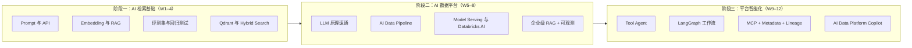

# AI Data / Platform Engineer 12 周学习路线

> 面向具备 **Python、SQL、Spark、Airflow、Databricks** 经验的数据工程师，目标岗位为 **AI Data Engineer** 与 **AI Platform Engineer**：从「会用 API」到「能交付可运维的 Data Platform Copilot」。
>
> **主线能力：** 生成式 AI 基础 → RAG 与评估 → 向量库工程化 →（原理与部署）→ 企业级 RAG → Agent / LangGraph → MCP → 综合项目

## 目录

- [先决条件与环境](#先决条件与环境)
- [三阶段路线图](#三阶段路线图)
- [学习目标与节奏](#学习目标与节奏)
- [12 周总览](#12-周总览)
- [路径设计说明](#路径设计说明)
- [GitHub 参考路线与对标](#github-参考路线与对标)
  - [对标仓库清单（维护表）](#对标仓库清单维护表)
- [分周计划（Week 1–12）](#week-1生成式-ai-与-prompt-engineering)
- [毕业项目与周交付映射](#毕业项目与周交付映射)
- [学习优先级与时间分配](#学习优先级与时间分配)
- [每周复盘模板](#每周复盘模板)
- [官方资源收藏](#官方资源收藏)
- [视频资源（按周）](#视频资源按周)
- [职业能力路径](#职业能力路径)

---

## 先决条件与环境

### 技能先决条件

| 领域 | 期望水平 |
|---|---|
| Python | 能写模块、依赖管理、简单 async |
| SQL | 复杂查询、只读分析场景 |
| 数据平台 | 接触过 Airflow / Spark / 仓库表结构 / Runbook |
| Git | 分支、PR、`.env` 不入库 |
| 容器 | 能跑 `docker compose` |

### 环境清单（Week 1 前完成）

- Python 3.11+，推荐 `uv` 或 `poetry` 管理虚拟环境
- Docker Desktop（Week 4 起 Qdrant；Week 12 Compose 全栈）
- 至少一种 LLM 访问方式：**OpenAI / Azure OpenAI API**，或本机 **Ollama**（Week 7 前备好）
- 可选 GPU：**选修** LoRA/PEFT（`week06-extra-finetuning/`）、Week 7 **选修** Ollama/vLLM；无 GPU 可走托管 API + 文档中的**选修路径**
- 本仓库约定：每周代码放在 `weekNN-<topic>/`，根目录不放密钥

### 与现有工作的衔接

每周尽量用**真实但脱敏**的材料练手（Airflow 文档、内部规范摘要、表结构样例、故障 Runbook），这样 Week 8 与 Week 12 不是从零造场景，而是**把前几周作业升格为产品化**。

---

## 三阶段路线图



| 阶段 | 周次 | 结束时你能演示什么 |
|---|---:|---|
| 一 | 1–4 | 带引用的多格式 RAG、1k+ 切片、Hybrid Search、可重复运行的评测集 |
| 二 | 5–8 | 增量知识入湖与向量化流水线、模型服务、Databricks AI 对齐、可观测企业 RAG |
| 三 | 9–12 | 多工具 Agent、审批流、元数据/血缘 MCP、Compose 一键启动的 AI Data Platform Copilot |

## 学习目标与节奏

完成本计划后，应具备：

- 使用云端或本地大模型开发生成式 AI 应用
- 理解 Prompt、Token、Embedding、Transformer 与 Attention（能讲清 RAG 里每一环在干什么）
- 独立构建**可评估**、带来源引用的 RAG 知识库（含 Hybrid / Rerank / 拒答）
- 使用 **Qdrant** 做语义检索、Payload 过滤与混合检索
- 使用 **Ollama** 或 **vLLM** 提供推理服务，并做基础压测
- **选修：** 读懂 SFT、LoRA、QLoRA 与 PEFT 配置（`week06-extra-finetuning/` 完成一次短训或前后对比表即可）
- 使用 **LangGraph** 组织 Agent 与多 Agent 工作流（AutoGen / CrewAI 作对比阅读）
- 使用 **MCP** 连接文件系统、GitHub 与数据平台类工具
- 交付一个可部署的 **AI Data Platform Copilot**（含日志与测试）

### 建议投入

| 时间 | 建议 |
|---|---:|
| 工作日 | 每天 1–1.5 小时 |
| 周末 | 4–6 小时 |
| 每周 | **10–15 小时**（低于 8 小时请优先「必做」） |
| 总周期 | 12 周（约 **120–180** 小时） |

### 每周固定动作

1. 阅读当周**必做**课程（选做留到有余力或第二遍）
2. 跑通官方示例 → 改成本周作业目录下的代码
3. 写清 `weekNN-*/README.md`：怎么跑、依赖、已知问题
4. 提交 **`RESULTS.md`**（借鉴 [agent-prep](https://github.com/shaneliuyx/agent-prep)）：关键数字与结论，避免「感觉学会了」——例如 RAG 通过率、P95 延迟、召回样例、微调前后对比表
5. 用当周**验收标准**自测；RAG 相关周更新测试问题集
6. Git 提交到对应周目录（不提交密钥与原始敏感数据）

---

## 12 周总览

| 周 | 阶段 | 主题 | 必做交付 | 学时（参考） |
|---:|---|---|---|---:|
| 1 | 一 | LLM、Prompt 与结构化输出 | API 客户端 + 3 个数据工程助手 | 10–12 |
| 2 | 一 | Embedding、搜索与 RAG 入门 | 多格式 RAG + Chunk 实验 | 12–15 |
| 3 | 一 | RAG 工程化与评估基线 | Airflow 文档助手 + 20 题 Ground Truth | 12–15 |
| 4 | 一 | Qdrant、Hybrid 与向量数据运维 | 1k+ Chunks + Filter + Hybrid + 备份验证 | 10–12 |
| 5 | 二 | LLM 原理速通与 AI 数据边界 | 原理说明 + 模型/RAG/微调选型决策表 | 5–7 |
| 6 | 二 | AI Data Pipeline | 增量知识摄取、质量校验、Embedding 与索引流水线 | 14–16 |
| 7 | 二 | Model Serving 与 Databricks AI | 模型端点压测 + Databricks AI 方案映射 | 12–15 |
| 8 | 二 | 企业级 RAG、评估与可观测 | Copilot V1 + 30 题评估 + Trace | 15–18 |
| 9 | 三 | Agent 基础与安全工具调用 | 多工具 + 只读访问 + 审计日志 | 12–14 |
| 10 | 三 | LangGraph 工作流 | Data Engineer 多节点图 + Human-in-the-loop | 14–16 |
| 11 | 三 | MCP、Metadata 与 Lineage | Data Catalog MCP + 表/Schema/血缘/Job 状态 | 14–16 |
| 12 | 三 | AI Data Platform Copilot | 可部署毕业项目 + 测试 + 评估报告 | 18–24 |

**核心课程来源：** Microsoft GenAI / OpenAI Cookbook → LangChain + LLM Zoomcamp → Qdrant → Databricks AI / MLflow → LlamaIndex / Ragas → Microsoft AI Agents → LangGraph → MCP 官方文档。

## 路径设计说明

以下调整用于**减少返工、对齐数据工程场景**，周次编号不变，便于目录与习惯一致。

1. **Week 3 起向量库统一为 Qdrant**  
   不要在 Week 3 用临时内存向量库再在 Week 4 重写。直接复用 `week04-qdrant/docker-compose.yml`（可在 Week 3 先建目录与 compose），索引与检索 API 从 Week 3 就针对 Qdrant。

2. **Week 5 可与 Week 3–4 并行阅读**  
   不必等 Week 5 才做 RAG。最低要求：Week 2 后读 [The Illustrated Transformer](https://jalammar.github.io/illustrated-transformer/) 前半；Week 5 集中补 Attention 实现与笔记。若做**选修微调**，需先理解「下一 Token 预测」。

3. **评估从 Week 3 开始线程化**  
   Week 3 建立 `evaluation_questions.json`（≥20 题）；Week 8 扩展到 ≥30 题并接入 **Ragas**（或先手写「来源是否命中」规则）。避免 Week 8 才第一次测质量。

4. **Week 6 主线是 AI Data Pipeline；微调整为选修**  
   必做周交付见 [Week 6](#week-6ai-data-pipeline)。时间充裕时在 W5 后或 W6 后加 3–6h，目录 `week06-extra-finetuning/`：精读 PEFT 文档 + `train_config.yaml` 与数据格式，用**已有 LoRA 权重**或云端 Notebook 跑 1 次短训练，产出「前后对比表 + 能解释 rank/alpha」写入 `RESULTS.md`。

5. **Week 8 是 Week 3–4 的产品化，不是第二个 science project**  
    ingestion / retrieval 模块从周作业**迁移+加固**（增量、Hybrid、Rerank、拒答、API），不要另起一套目录结构。

6. **Agent 栈以 LangGraph 为主**  
   Week 9 理解 Tool / Memory / Agentic RAG；Week 10 用 LangGraph 实现审批与路由。AutoGen、CrewAI 各选 1 个官方 Quickstart 对比即可。

7. **可选：Databricks 对齐（与 NIKE/EDA 栈一致）**  
   - RAG 文档源：Unity Catalog 表说明、Job 说明、内部 Markdown  
   - 评估与追踪：MLflow Tracing / GenAI Evaluate（有 workspace 时替代部分手写评估表）  
   - MCP：表搜索、Job 运行状态、血缘查询与 Week 11 作业对齐  

8. **可观测性不要拖到毕业周**  
   Week 8 起在 API 层记录 trace id；选修接入 [Phoenix](https://github.com/Arize-ai/phoenix) 或 [Langfuse](https://langfuse.com/docs)，与 [LLM Zoomcamp 2026](https://github.com/DataTalksClub/docs/blob/main/courses/llm-zoomcamp/whats-new.md) 的 Evaluation + Monitoring 模块对齐。

---

## GitHub 参考路线与对标

网上有不少开源「AI / LLM 工程师」路线。本仓库的定位是：**12 周、数据平台场景、单一技术栈（Qdrant + LangGraph + MCP）**。对标仓库以 **[对标仓库清单（维护表）](#对标仓库清单维护表)** 为唯一列表来源；下文映射与选修仅说明**如何用**，新增/下线仓库时只改维护表即可。

### 对标仓库清单（维护表）

> **维护约定：** 发现新的路线、lab 或官方课仓库时，在对应分类下**追加一行**（勿删历史行，可标 `状态：归档`）。大版本课纲变更在「备注」写年份（如 Zoomcamp 2026）。本表上次整理：**2026-09**。

#### 路线图与课表（curriculum）

| 仓库 | 链接 | 周期 | 状态 | 在本计划中的用途 |
|---|---|---|:---:|---|
| mlabonne/llm-course | https://github.com/mlabonne/llm-course | 自学 | 活跃 | **LLM Engineer** 线；W5–7 原理与部署索引 |
| DataTalksClub/llm-zoomcamp | https://github.com/DataTalksClub/llm-zoomcamp | ~10 周 | 活跃 | 作业与毕业 rubric；W3–4 向量检索、W8 评估/监控 |
| DataTalksClub/docs（llm-zoomcamp） | https://github.com/DataTalksClub/docs/tree/main/courses/llm-zoomcamp | 文档 | 活跃 | 2026 课纲、环境、项目说明（whats-new） |
| abhishekdubey331/AI-Engineer-RoadMap | https://github.com/abhishekdubey331/AI-Engineer-RoadMap | 16 周 | 活跃 | 按日粒度参考；W9–12 Agent eval / capstone 思路 |
| tal7aouy/LLM-Engineering | https://github.com/tal7aouy/LLM-Engineering | 24 周 | 活跃 | 百科索引；W7 推理部署、W11 MCP 深读 |
| seshakiran/learn-ai-in-12-weeks | https://github.com/seshakiran/learn-ai-in-12-weeks | 12 周 | 活跃 | W9 安全、失败注入与 adversarial 测试对标 |

#### 实测 Lab 与专题仓库

| 仓库 | 链接 | 周期 | 状态 | 在本计划中的用途 |
|---|---|---|:---:|---|
| shaneliuyx/agent-prep | https://github.com/shaneliuyx/agent-prep | 12 周 lab | 活跃 | 每周 `RESULTS.md` 范式；RAGAS / HyDE / Agentic RAG lab |
| shaneliuyx/agent-development-curriculum | https://github.com/shaneliuyx/agent-development-curriculum | 12 周 | 活跃 | agent-prep 配套正文；选修 rerank、GraphRAG 章节 |
| aarunbhardwaj/rag-engineering | https://github.com/aarunbhardwaj/rag-engineering | 分 Stage | 活跃 | W2/4/8 **选修** notebook（Naive→生产 RAG） |

#### 官方开源课程（本计划主课引用）

| 仓库 | 链接 | 状态 | 在本计划中的用途 |
|---|---|:---:|---|
| microsoft/generative-ai-for-beginners | https://github.com/microsoft/generative-ai-for-beginners | 活跃 | **W1–2** Prompt、RAG 入门 |
| microsoft/ai-agents-for-beginners | https://github.com/microsoft/ai-agents-for-beginners | 活跃 | **W9** Agent、Tool；**W11 选修** MCP（L11） |
| openai/openai-cookbook | https://github.com/openai/openai-cookbook | 活跃 | **W2** Embedding、向量检索示例 |

#### 框架、工具与可观测（非完整课表，按周查阅）

| 仓库 / 项目 | 链接 | 状态 | 在本计划中的用途 |
|---|---|:---:|---|
| langchain-ai/langchain | https://github.com/langchain-ai/langchain | 活跃 | W3+ RAG 组件 |
| langchain-ai/langgraph | https://github.com/langchain-ai/langgraph | 活跃 | W10、W12 Agent 图 |
| qdrant/qdrant | https://github.com/qdrant/qdrant | 活跃 | W3–4、W8 向量库 |
| hiyouga/LLaMA-Factory | https://github.com/hiyouga/LLaMA-Factory | 活跃 | W6 **选修**微调（`week06-extra-finetuning/`） |
| microsoft/mcp-for-beginners | https://github.com/microsoft/mcp-for-beginners | 活跃 | **W11** MCP 概念与分课视频 |
| dmatrix/mlflow-genai-tutorials | https://github.com/dmatrix/mlflow-genai-tutorials | 活跃 | W7–8 **选修** Tracing / GenAI 开发视频与 notebook |
| ollama/ollama | https://github.com/ollama/ollama | 活跃 | W7 本地推理 |
| vllm-project/vllm | https://github.com/vllm-project/vllm | 活跃 | W7 服务化（有 GPU） |
| modelcontextprotocol/servers | https://github.com/modelcontextprotocol/servers | 活跃 | W11 官方 MCP Server 示例 |
| Arize-ai/phoenix | https://github.com/Arize-ai/phoenix | 活跃 | W8 选修 RAG trace / 评估 UI |
| langfuse/langfuse | https://github.com/langfuse/langfuse | 活跃 | W8–12 选修 LLM 可观测与评测 |
| databricks/mlflow（GenAI） | https://github.com/mlflow/mlflow | 活跃 | 选修：Tracing / Evaluate（有 Databricks 时） |

### 与本计划周次映射（主课 + 推荐选修）

| 本计划 | 主线已覆盖 | 建议从 GitHub 补充 |
|:---:|---|---|
| W1–2 | MS GenAI + RAG 原型 | Zoomcamp Module 1（Agentic RAG 概念可先浏览，不抢先实现） |
| W3–4 | LangChain + Qdrant | Zoomcamp Module 2 向量检索；rag-engineering Stage 1–3 任选一 notebook |
| W5–7 | 原理选型 + AI Data Pipeline + 部署 | mlabonne **LLM Engineer** §1 Running LLMs、§6 Deploying；mlflow-genai-tutorials（Tracing） |
| W8 | 企业 RAG + Ragas | agent-prep `lab-03-rag-eval`；Zoomcamp Module 4–5 评估与监控 |
| W9–10 | Agent + LangGraph | agent-prep ReAct / 多 Agent 拓扑 lab；AI-Engineer-RoadMap Week 13–14 |
| W11–12 | MCP + Copilot | Zoomcamp Module 3 编排（Kestra）**或** 用 Airflow 编排 ingestion（更贴 DE） |

### 与 2026 行业路线的差异（刻意选择）

| 话题 | 常见开源路线 | 本计划选择 | 理由 |
|---|---|---|---|
| 向量库 | PGVector / Chroma / minsearch | **Qdrant** | 与 Hybrid、Payload 过滤、生产部署练习一致 |
| 编排 | Kestra / Temporal | **代码 + 可选 Airflow** | 对齐现有数据平台技能 |
| 第一课 | Agentic RAG 先行（Zoomcamp 2026） | **先 Prompt + 经典 RAG** | DE 先建立检索与评测再上 Agent，失败面更小 |
| Capstone | 通用 RAG App / SWE-bench | **AI Data Platform Copilot** | 作品集与岗位叙事一致 |
| 微调 | 16 周路线常占 2 周+ | **1 周选修加深** | 应用岗优先级低于 RAG / Agent / MCP |

### 选修周（时间充裕时插入，不改周编号）

在对应主线周**之后**加 3–6 小时即可，目录建议 `weekNN-extra-<topic>/`：

| 选修 | 参考来源 | 建议插入点 | 产出 |
|---|---|---|---|
| Rerank + 上下文压缩 | agent-development-curriculum Week 2 | W4 后 | `RESULTS.md`：有无 rerank 的命中率对比 |
| HyDE / Multi-Query | agent-prep RAG eval lab | W3 后 | 同一评测集上 A/B |
| GraphRAG | rag-engineering NB 08；curriculum Week 2.5 | W8 前 | 多跳问答 5 题对比向量基线 |
| Agentic RAG / CRAG | agent-prep Week 3.7 | W9 前 | 与 Week 8 单遍检索对比 faithfulness |
| Agent 评估 + OTel | AI-Engineer-RoadMap W15；Zoomcamp Monitoring | W10 后 | 坏例集 + trace 截图写入 `RESULTS.md` |
| LoRA / PEFT 短训 | LLaMA-Factory；[PEFT](https://huggingface.co/docs/peft/index) | W5 后或 W6 后 | `week06-extra-finetuning/` + `RESULTS.md` 前后对比 |

### 能力自检（招聘向六域，摘自 agent 课程 rubric 的简化版）

完成 12 周后可用下表自评「是否有**可展示 artifact**」，而不只是看过文档：

| 域 | 本计划主要周次 | 你应能拿出的证据 |
|---|---|---|
| RAG 与检索 | 2–4, 8 | 评测集 + Hybrid/Rerank + `RESULTS.md` |
| Agent / 工具 / 编排 | 9–10, 12 | LangGraph 图 + 审批 + 工具审计日志 |
| 评估与可观测 | 3, 8, 12 | Ragas 或规则评估；请求/trace 日志 |
| 推理与部署 | 7 | 压测表 + OpenAI 兼容端点 |
| 微调（可选） | 6 | 前后对比 + `train_config.yaml` |
| 平台集成 | 11–12 | 自研 MCP + 安全设计文档 |

---

## Week 1：生成式 AI 与 Prompt Engineering

**本周投入：** 10–12h · **必做：** 课程 00–05 + 3 个助手 · **选做：** 06–07 多模态章节

### 学习目标

- 理解 LLM、Token、上下文窗口和常用生成参数
- 掌握 Zero-shot、Few-shot、Role Prompt 和结构化输出
- 能通过 Python SDK 调用大模型

### 课程与章节

- [Generative AI for Beginners](https://microsoft.github.io/generative-ai-for-beginners/) · [GitHub](https://github.com/microsoft/generative-ai-for-beginners)
- [00 - Course Setup](https://github.com/microsoft/generative-ai-for-beginners/tree/main/00-course-setup) · [01 - Introduction](https://github.com/microsoft/generative-ai-for-beginners/tree/main/01-introduction-to-genai) · [02 - Comparing LLMs](https://github.com/microsoft/generative-ai-for-beginners/tree/main/02-exploring-and-comparing-different-llms) · [03 - Responsible AI](https://github.com/microsoft/generative-ai-for-beginners/tree/main/03-using-generative-ai-responsibly) · [04 - Prompt Fundamentals](https://github.com/microsoft/generative-ai-for-beginners/tree/main/04-prompt-engineering-fundamentals) · [05 - Advanced Prompts](https://github.com/microsoft/generative-ai-for-beginners/tree/main/05-advanced-prompts)

### 作业

1. 编写模型 API 客户端：System Prompt、用户输入、**耗时与 Token 统计**、可选流式。
2. 实现邮件润色、工作日报、**SQL 生成**三个助手（SQL 助手为全课程红线场景，后续周会复用）。
3. 整理 ≥10 个可复用 Prompt（SQL、PySpark、Airflow、文档总结、故障分析等），写入 `prompt_templates.md`。

### 交付物

- `week01-genai-basics/chat_client.py`
- `week01-genai-basics/prompt_templates.md`
- `week01-genai-basics/README.md`

### 验收标准

- [ ] 能解释 Token、上下文窗口、Temperature、Top-p
- [ ] 能区分 Zero-shot 与 Few-shot
- [ ] 能拿到**结构化 JSON**输出（`response_format` 或等价约束）
- [ ] 完成 3 个 Prompt 应用

---

## Week 2：Embedding、搜索与 RAG 入门

**本周投入：** 12–15h · **必做：** RAG 端到端 + Chunk 实验 · **选做：** OpenAI Cookbook 其他 vector 示例

### 学习目标

- 理解 Embedding、余弦相似度与 RAG 全流程
- 加载并切分 PDF、Markdown、TXT，保留元数据
- 完成带引用来源的文档问答

### 课程与章节

- [08 - Building Search Applications](https://github.com/microsoft/generative-ai-for-beginners/tree/main/08-building-search-applications) · [15 - RAG and Vector Databases](https://github.com/microsoft/generative-ai-for-beginners/tree/main/15-rag-and-vector-databases)
- [OpenAI Cookbook](https://github.com/openai/openai-cookbook) · [Vector DB Examples](https://github.com/openai/openai-cookbook/tree/main/examples/vector_databases)
- 选读：[11 - Function Calling](https://github.com/microsoft/generative-ai-for-beginners/tree/main/11-integrating-with-function-calling)（Week 9 会再用）

### RAG 流程

```text
Document → Loader → Splitter → Chunks → Embeddings → Vector Store
         → Retriever → Context + Question → LLM → Answer + Sources
```

### 作业

1. 支持 PDF / MD / TXT，元数据含文档名、页码或段落、Chunk ID。
2. PDF 问答：上传、索引、检索、回答、**来源引用**。
3. 对比 Chunk Size `300/500/800`、Overlap `0/50/100`、Top-K `3/5/10`，结论写入 `chunk_experiment.md`（选 1 组作为 Week 3 默认）。

### 交付物

- `week02-rag-basics/document_loader.py`
- `week02-rag-basics/index_documents.py`
- `week02-rag-basics/rag_chat.py`
- `week02-rag-basics/chunk_experiment.md`

### 验收标准

- [ ] 能解释 Embedding 与余弦相似度
- [ ] ≥3 种文档格式
- [ ] 回答含来源位置
- [ ] 完成 Chunk 参数实验并有**明确推荐默认值**

---

## Week 3：LangChain 与 RAG 工程化

**本周投入：** 12–15h · **必做：** 流水线拆分 + Qdrant + 20 题评测集 · **选做：** LLM Zoomcamp 额外模块

### 学习目标

- LangChain（或同构抽象）的加载、切分、索引、检索、生成
- **索引与问答解耦**，可增量更新
- 建立可持续扩展的评测问题集

### 课程与章节

- [LangChain Overview](https://docs.langchain.com/oss/python/langchain/overview) · [Retrieval](https://docs.langchain.com/oss/python/langchain/retrieval) · [GitHub](https://github.com/langchain-ai/langchain)
- [LLM Zoomcamp](https://github.com/DataTalksClub/llm-zoomcamp)

### 作业

1. 语料：Airflow 官方文档 + 脱敏 Runbook（与 Week 8 同源，避免重复收集）。
2. **使用 Qdrant**（compose 可与 `week04-qdrant` 共享）：增量索引、Top-K、Metadata Filter、来源引用、**检索日志**（打了哪些 chunk）。
3. `evaluation_questions.json` ≥20 题：预期答案要点、预期来源、实际召回、是否通过。

### 交付物

- `week03-airflow-rag/ingestion_pipeline.py`
- `week03-airflow-rag/retrieval_pipeline.py`
- `week03-airflow-rag/evaluation_questions.json`

### 验收标准

- [ ] 索引与问答逻辑分离
- [ ] 支持增量导入与 Metadata Filter
- [ ] 可查看实际召回 Chunks
- [ ] ≥20 题评测集且每周可重跑

---

## Week 4：Qdrant 向量数据库

**本周投入：** 10–12h · **必做：** 持久化 + 1k Chunks + Hybrid · **选做：** 多 Collection 与备份策略

### 学习目标

- Docker 部署 Qdrant，理解 Collection / Point / Payload / Filter
- Dense、Sparse 与 Hybrid Search 的差异与适用场景

### 课程与章节

- [Qdrant Documentation](https://qdrant.tech/documentation/) · [Quickstart](https://qdrant.tech/documentation/quickstart/) · [Collections](https://qdrant.tech/documentation/concepts/collections/) · [Search](https://qdrant.tech/documentation/concepts/search/) · [Filtering](https://qdrant.tech/documentation/concepts/filtering/) · [Hybrid Queries](https://qdrant.tech/documentation/concepts/hybrid-queries/)

### 作业

1. `docker-compose.yml` 持久化卷；重启后数据仍在。
2. 导入 **≥1,000** Chunks（可合并 Week 3 语料），Payload：文档 ID、类型、来源、更新时间等。
3. 语义检索、Filter、Top-K、Hybrid；`benchmark.md` 记录写入/查询耗时与 2–3 个召回样例。

### 交付物

- `week04-qdrant/docker-compose.yml`
- `week04-qdrant/create_collection.py`
- `week04-qdrant/load_vectors.py`
- `week04-qdrant/search_vectors.py`
- `week04-qdrant/benchmark.md`

### 验收标准

- [ ] 重启不丢数据
- [ ] ≥1,000 Chunks
- [ ] Payload 更新/删除与 Filter
- [ ] 有 Hybrid 或明确说明为何仅用 Dense

---

## Week 5：LLM 原理速通与 AI 数据选型

**本周投入：** 5–7h · **必做：** 原理理解 + 选型判断 · **不要求手写完整 Transformer**

### 学习目标

- 理解 Tokenization、Embedding、Attention、Decoder-only、上下文窗口与下一 Token 预测
- 能解释 Prompt、RAG、Fine-tuning 各自解决什么问题
- 能从数据新鲜度、可解释性、权限、成本和延迟角度做方案选择

### 作业

- 输出 `llm-for-data-engineers.md`：用数据工程语言解释 LLM 与 RAG
- 输出 `solution-decision-matrix.md`：Prompt vs RAG vs Fine-tuning vs Tool Calling
- 保留一个最小 Attention 示例为选修，不作为主线阻塞项

### 验收标准

- [ ] 能解释 Embedding 检索与模型生成的边界
- [ ] 能说明何时优先修数据、修检索、修 Prompt，而不是微调模型
- [ ] 能解释上下文窗口、幻觉与数据时效性的关系

---

## Week 6：AI Data Pipeline

**本周投入：** 14–16h · **岗位核心周**

### 学习目标

- 构建从源系统到向量索引的可增量、幂等、可观测数据链路
- 掌握解析、规范化、去重、切片、Embedding、索引更新与删除传播
- 将数据质量、版本、血缘和权限元数据带入 RAG

### 推荐流程

```text
Source → Extract → Parse → Normalize → Deduplicate → Chunk
       → Quality Check → Embed → Index → Validate → Publish
```

### 作业

- 数据源至少覆盖 Markdown/PDF/表结构样例，可选 Confluence/SharePoint 脱敏导出
- 使用 Airflow 或 Databricks Workflows 编排 ingestion
- 使用内容哈希实现幂等和增量处理
- 支持新增、修改、删除三类 CDC 语义
- 为每个 Chunk 保存 `document_id`、`version`、`source`、`updated_at`、`acl`、`checksum`
- 建立质量规则：空内容、解析失败、重复率、Chunk 长度、Embedding 失败、索引数量对账
- 将运行结果写入 `pipeline_metrics.json` 和 `RESULTS.md`

### 交付物

- `week06-ai-data-pipeline/dags/` 或 `workflows/`
- `week06-ai-data-pipeline/src/{extract,transform,chunk,embed,index}/`
- `week06-ai-data-pipeline/tests/`
- `week06-ai-data-pipeline/data-contract.md`
- `week06-ai-data-pipeline/RESULTS.md`

### 验收标准

- [ ] 重跑不产生重复数据
- [ ] 文档修改后只处理受影响内容
- [ ] 删除源文档后可删除对应向量
- [ ] 原始文档数、有效文档数、Chunk 数和索引数可对账
- [ ] 失败任务可重试，错误记录可定位

---

## Week 7：Model Serving 与 Databricks AI

**本周投入：** 12–15h · **主线：企业托管方案** · **选修：Ollama / vLLM**

### 学习目标

- 理解模型 API、托管 Serving 与自建推理的选型边界
- 熟悉 OpenAI-compatible Client、超时、重试、限流、Fallback 与成本记录
- 将现有 Qdrant RAG 映射到 Databricks AI 能力

### 学习范围

- Azure OpenAI / OpenAI-compatible API
- Databricks Model Serving、Vector Search、Unity Catalog、MLflow Tracing / Evaluation
- Ollama 本地开发；vLLM 作为有 GPU 时的选修部署

### 作业

- 封装统一模型网关：provider、model、timeout、retry、fallback、token/成本日志
- 对至少两个可用端点执行压测，记录成功率、P50/P95、TTFT 或首响应时间
- 编写 `databricks-ai-mapping.md`：Qdrant、FastAPI、Tracing、权限和 Serving 如何映射到 Databricks
- 有 Databricks workspace 时，完成一个 Vector Search 或 Model Serving 最小实验；没有环境时完成架构与接口设计

### 交付物

- `week07-model-serving/model_gateway.py`
- `week07-model-serving/benchmark.py`
- `week07-model-serving/benchmark-results.md`
- `week07-model-serving/databricks-ai-mapping.md`

### 验收标准

- [ ] 模型供应商可通过配置切换
- [ ] 有超时、重试、限流和 fallback 策略
- [ ] 有可复现性能数字与调用日志
- [ ] 能解释托管服务与自建推理在安全、成本、维护和性能上的权衡

---

## Week 8：企业级 RAG

**本周投入：** 15–18h · **阶段二里程碑**

### 学习目标

- 在 Week 3–4 基础上：**Hybrid、Rerank、拒答、增量、评估**
- 交付 **Data Platform Copilot V1**（API 优先，UI 可极简）

### 课程与章节

- [LangChain Retrieval](https://docs.langchain.com/oss/python/langchain/retrieval) · [LlamaIndex Starter](https://docs.llamaindex.ai/en/stable/getting_started/starter_example/) · [Ragas](https://docs.ragas.io/)

### 作业

1. 知识库：Airflow、Databricks、Spark、规范、脱敏 Runbook（与前几周语料合并治理）。
2. Dense + Filter + Hybrid + Rerank + 引用 + **无资料拒答**。
3. 评测 ≥30 题：来源命中、忠实度、相关性（Ragas 或规则表）；结果存档 `evaluation/`。
4. **选修：** 用 Phoenix / Langfuse / MLflow Tracing 记录至少一次完整 RAG 请求链路（对标 Zoomcamp Monitoring）。

### 交付物

- `week08-enterprise-rag/ingestion/` · `retrieval/` · `evaluation/` · `api/`
- `week08-enterprise-rag/RESULTS.md`（通过率、典型失败 case、P95 延迟）
- `week08-enterprise-rag/ui/`（可选 Streamlit）
- `week08-enterprise-rag/docker-compose.yml`

### 验收标准

- [ ] 增量、Filter、Hybrid、Rerank 至少各 1 处落地
- [ ] 有引用；无资料不编造
- [ ] ≥30 题评估可重复运行

---

## Week 9：AI Agent 基础

**本周投入：** 12–14h · **必做：** 3 工具 + 护栏 · **选做：** Agentic RAG 与 Week 8 联调

### 学习目标

- Agent、Tool Calling、Memory、Agentic RAG
- 安全的多工具 Agent（只读 SQL、审计日志）

### 课程与章节

- [AI Agents for Beginners](https://microsoft.github.io/ai-agents-for-beginners/) · [GitHub 课表与分课视频](https://github.com/microsoft/ai-agents-for-beginners) · **必做** 01–07（Setup 至 Planning）
- **说明：** 官方示例偏 Microsoft Agent Framework / Foundry；本仓库作业按 **LangGraph + FastAPI** 实现，视频学概念与模式即可。
- **W11 前选修：** [11 - Agentic Protocols (MCP)](https://github.com/microsoft/ai-agents-for-beginners/tree/main/11-agentic-protocols)（与 Week 11 衔接）

### 作业

1. 工具：时间查询、文档搜索（接 Week 8 检索）、SQLite **只读**。
2. Memory：最近对话、会话摘要、清除；可选用户偏好。
3. 护栏：参数校验、SQL 只读、超时重试、高风险拒绝、**工具调用审计日志**。

### 交付物

- `week09-agent-basics/agent.py` · `tools/` · `memory/` · `guardrails/`

### 验收标准

- [ ] 路由到正确工具
- [ ] Tool Schema 清晰
- [ ] SQL 仅 SELECT
- [ ] 每次工具调用有日志

---

## Week 10：LangGraph 与 Multi-Agent

**本周投入：** 14–16h · **必做：** LangGraph · **选做：** AutoGen/CrewAI 各 1 个 demo

### 学习目标

- 状态图、条件路由、持久化、Human-in-the-loop
- Data Engineer 多角色：分析 → 生成 → 审查 → 安全

### 课程与章节

- [LangGraph Overview](https://docs.langchain.com/oss/python/langgraph/overview) · [Quickstart](https://docs.langchain.com/oss/python/langgraph/quickstart) · [Workflows and Agents](https://docs.langchain.com/oss/python/langgraph/workflows-agents)

### 作业

1. 节点：SQL / PySpark / Airflow DAG 生成（复用 Week 1 Prompt 与 Week 8 上下文）。
2. 流程：Requirement → Generator → Reviewer → Security Checker。
3. 写 SQL、改文件、改 DAG、调外部 API 前 **人工审批**。

### 交付物

- `week10-langgraph-agent/graph.py` · `state.py` · `nodes/` · `tools/` · `reviewers/`

### 验收标准

- [ ] ≥4 节点 + 1 条条件边
- [ ] 审查与安全检查
- [ ] 高风险需批准；失败可重试或降级

---

## Week 11：MCP、Metadata 与 Data Lineage

**本周投入：** 14–16h · **岗位核心周**

### 学习目标

- 理解 MCP Host / Client / Server，以及 Tool、Resource 与 Prompt 的边界
- 将数据目录、Schema、血缘、Owner、质量状态和 Job 状态暴露为安全的只读能力
- 构建可审计的 **Data Catalog MCP**

### 课程与章节

- [MCP for Beginners](https://github.com/microsoft/mcp-for-beginners)（分课视频见各章 README；全集 [YouTube](https://www.youtube.com/watch?v=VfZlglOWWZw)）
- [AI Agents for Beginners · 11 - Agentic Protocols (MCP)](https://github.com/microsoft/ai-agents-for-beginners/tree/main/11-agentic-protocols) · [Video](https://youtu.be/X-Dh9R3Opn8)
- [modelcontextprotocol/servers](https://github.com/modelcontextprotocol/servers) 官方 Server 示例

### 作业

- 跑通 Filesystem MCP 或 GitHub MCP，并限制访问范围
- 自研 Data Catalog MCP，至少提供：
  - `search_tables`
  - `get_table_schema`
  - `get_table_lineage`
  - `get_data_quality_status`
  - `get_job_run_status`
- 优先对接 Unity Catalog / Databricks Jobs；无环境时使用结构化 mock，但接口契约保持真实
- 加入 allowlist、只读控制、超时、分页、脱敏、审计日志和错误码
- 编写 `metadata-contract.md` 与 `security-design.md`

### 交付物

- `week11-mcp-data-catalog/server.py`
- `week11-mcp-data-catalog/client.py`
- `week11-mcp-data-catalog/tools/`
- `week11-mcp-data-catalog/resources/`
- `week11-mcp-data-catalog/metadata-contract.md`
- `week11-mcp-data-catalog/security-design.md`

### 验收标准

- [ ] 跑通 1 个官方 Server + 1 个自研 Data Catalog Server
- [ ] 能通过自然语言找到表、字段、上游/下游与作业状态
- [ ] 所有工具默认只读，调用均有审计记录
- [ ] 敏感字段与未授权资产不会进入模型上下文

---

## Week 12：毕业项目 AI Data Platform Copilot

**本周投入：** 18–24h · **整合，避免新造轮子**

### 项目目标

把 Week 6 数据管道、Week 8 RAG API、Week 10 工作流和 Week 11 Data Catalog MCP **合并**为可 Compose 启动的 AI Data Platform Copilot，并补齐数据质量、可观测性、评估与测试。

### 推荐架构

```text
Web UI (Streamlit / 可选 Next.js)
  ↓
FastAPI
  ↓
LangGraph Agent
  ├── RAG (Week 8)
  ├── SQL / PySpark / Airflow Generators
  ├── Reviewer + Security
  └── MCP Client (Week 11)
  ↓
Cloud LLM or Ollama/vLLM (Week 7)
  ↓
Qdrant (Week 4)
```

### 功能要求（摘要）

| 模块 | 要求 |
|---|---|
| RAG | 增删改索引、Hybrid、Rerank、引用、拒答 |
| SQL | NL→SQL、方言、格式化与风险提示；**不执行写操作** |
| PySpark | DataFrame API；提示 Join/Collect/分区风险 |
| Airflow | DAG/Schedule/Retry/Callback；检查 catchup/并发 |
| 工作流 | 意图路由 → 生成 → 审查 → 安全 → **人工批准** → 响应 |
| 可观测性 | Request ID、路由、工具调用、检索片段、Token、延迟、错误状态 |

### 推荐技术栈

Python · FastAPI · Airflow 或 Databricks Workflows · Spark/Delta · LangGraph · LangChain 或 LlamaIndex · Qdrant/Databricks Vector Search · OpenAI/Azure OpenAI/Model Serving · MLflow · MCP SDK · Docker Compose · pytest · Ruff

### 建议仓库结构

```text
data-engineer-copilot/
├── README.md · .env.example · docker-compose.yml · pyproject.toml
├── app/{api,agent,rag,tools,mcp,prompts,ui}
├── ingestion/ · evaluation/ · tests/ · scripts/ · docs/
```

### 最终验收标准

- [ ] `docker compose up` 可启动核心路径
- [ ] RAG 有引用；无资料拒答
- [ ] Agent 路由与工具失败可处理
- [ ] 高风险需人工批准；SQL/文件默认只读或受限
- [ ] 环境变量配置；含测试、架构说明、部署步骤

---

## 毕业项目与周交付映射

| 毕业项目模块 | 主要来源周 | 迁移时注意 |
|---|---|---|
| `app/rag/*` | 3, 4, 8 | 勿复制粘贴第三套 ingestion |
| `app/api` + Compose | 7, 8 | 模型端点环境变量化 |
| `app/agent/graph` | 9, 10 | 审批节点与 Week 10 一致 |
| `app/mcp/*` | 11 | 安全设计文档进 `docs/` |
| SQL 风格与评测 | 1, 6 | Week 1 Prompt 模板 + Week 6 数据契约；微调仅 `week06-extra-finetuning/` 选修 |
| `evaluation/*` | 3, 8 | 问题集合并去重 |
| 压测与 SLO 参考 | 7 | 写入 `docs/performance.md` |

---

## 学习优先级与时间分配

时间不够时，优先保留 AI Data Engineer 岗位最能形成作品证据的模块。

| 方向 | 建议占比 | 优先级 |
|---|---:|---|
| AI Data Pipeline、数据质量与增量同步 | 25% | 最高 |
| 企业级 RAG、检索与向量数据运维 | 25% | 最高 |
| Evaluation、Regression 与 Observability | 15% | 最高 |
| Databricks AI、Unity Catalog 与 Model Serving | 15% | 高 |
| Agent 与 LangGraph | 10% | 高 |
| MCP、Metadata 与 Lineage | 7% | 高 |
| LLM 原理与 Prompt | 3% | 基础 |
| LoRA / QLoRA | 选修 | 低 |

**固定主栈：** Python + FastAPI + Airflow/Databricks Workflows + Spark/Delta + LangChain/LangGraph + Qdrant/Databricks Vector Search + MLflow + MCP + Docker Compose

#### 常见误区
- 把 AI Data Engineer 学成算法工程师 → 原理够用即可，主攻数据管道、质量、检索和平台化
- 只做一次性文档导入 → 必须支持幂等、增量、删除传播、版本和对账
- 只看回答效果 → 同时记录召回、忠实度、延迟、Token/成本和失败类型
- 每周换一套向量库 → 本地固定 Qdrant，企业平台再映射 Databricks Vector Search
- Agent 无护栏直连生产 → 默认只读、最小权限、审批、审计、超时和 allowlist
- 毕业周重新造轮子 → Week 6、8、10、11 的模块直接汇入最终项目

## 每周复盘模板

```markdown
## Week X 学习复盘

### 本周目标（必做 / 选做）

- 必做：
- 选做：

### 课程进度

- [ ] 
- [ ] 

### 作业与交付物

- [ ] 
- GitHub 路径：

### 三个核心概念（用自己的话）

1. 
2. 
3. 

### 阻塞与解决

1. 

### 评测 / 指标（RAG 周填写）

- 题数：  通过率：  主要失败类型：

### 自评（/10）

理论 · 实践 · 排错 · 工程 · 文档

### 下周一条改进

- 
```

---

## 官方资源收藏

**GitHub 对标与课表仓库**统一见上文 [对标仓库清单（维护表）](#对标仓库清单维护表)。以下为**非 GitHub 或文档站**补充链接，避免与维护表重复。

### 课程与文档（站点）

| 类别 | 资源 |
|---|---|
| 生成式 AI（站点） | [Microsoft Generative AI for Beginners](https://microsoft.github.io/generative-ai-for-beginners/)（仓库见维护表） |
| AI Agent（站点） | [Microsoft AI Agents for Beginners](https://microsoft.github.io/ai-agents-for-beginners/)（仓库见维护表） |
| LangChain / LangGraph | [LangChain Docs](https://docs.langchain.com/) · [LangGraph](https://docs.langchain.com/oss/python/langgraph/overview) |
| LlamaIndex / Ragas | [LlamaIndex](https://docs.llamaindex.ai/) · [Ragas](https://docs.ragas.io/) |
| 向量库文档 | [Qdrant Documentation](https://qdrant.tech/documentation/)（服务端仓库见维护表） |
| 微调文档 | [PEFT](https://huggingface.co/docs/peft/index)（LLaMA-Factory 见维护表） |
| 推理文档 | [vLLM Docs](https://docs.vllm.ai/)（Ollama / vLLM 仓库见维护表） |
| 多 Agent 对比 | [AutoGen](https://microsoft.github.io/autogen/) · [CrewAI](https://docs.crewai.com/) |
| MCP 协议 | [modelcontextprotocol.io](https://modelcontextprotocol.io/)（官方 servers 见维护表） |
| 可观测（文档） | [Langfuse Docs](https://langfuse.com/docs) · [Phoenix](https://arize.com/docs/phoenix) |

---

## 视频资源（按周）

链出自 [对标仓库清单](#对标仓库清单维护表) 中课表的 README；**分课短视频**以各模块 `lessons/` 或课表内 Video 列为准（[LLM Zoomcamp FAQ](https://datatalks.club/faq/llm-zoomcamp.html) 亦建议优先跟 GitHub 模块导航）。

### Playlist 与总览

| 用途 | 链接 | GitHub 出处 |
|---|---|---|
| LLM Zoomcamp 模块预录主列表 | https://www.youtube.com/playlist?list=PL3MmuxUbc_hLZFNgSad56pDBKK8KO0XIv | [llm-zoomcamp](https://github.com/DataTalksClub/llm-zoomcamp) · [resources.md](https://github.com/DataTalksClub/docs/blob/main/courses/llm-zoomcamp/resources.md) |
| LLM Zoomcamp 2026 cohort 录播 | https://www.youtube.com/playlist?list=PL3MmuxUbc_hJAmLLf2x1LSKRKbZwKXoHd | 同上 |
| DataTalks.Club 频道 | https://www.youtube.com/@DataTalksClub | 同上 |
| Generative AI for Beginners 全集（可选） | https://www.youtube.com/watch?v=k7HaeJs-N-o | 单课以 [generative-ai-for-beginners](https://github.com/microsoft/generative-ai-for-beginners) 课表为准 |
| MCP for Beginners 全集（11 课） | https://www.youtube.com/watch?v=VfZlglOWWZw | [mcp-for-beginners](https://github.com/microsoft/mcp-for-beginners) |

### 按周推荐

| 周 | 主题 | 推荐视频 | GitHub 出处 |
|---:|---|---|---|
| 1 | Prompt / GenAI | 课 01–05 README 内 Video（如 L1: https://aka.ms/gen-ai-lesson-1-gh） | [generative-ai-for-beginners](https://github.com/microsoft/generative-ai-for-beginners) |
| 2 | Embedding / RAG | 课 08、15 视频链接 | 同上 |
| 3 | RAG 工程化 | [Build Your First RAG Application](https://www.youtube.com/watch?v=KSItlTAsMsk)（选修全长） | [01-agentic-rag/README](https://github.com/DataTalksClub/llm-zoomcamp/blob/main/01-agentic-rag/README.md) |
| 4 | 向量 / Hybrid 概念 | [Vector Databases… Hybrid Retrieval](https://www.youtube.com/watch?v=BC3NsRUNEIg) | [02-vector-search/README](https://github.com/DataTalksClub/llm-zoomcamp/blob/main/02-vector-search/README.md) |
| 5 | 原理速通 | GenAI L01–02 视频；图文 [Illustrated Transformer](https://jalammar.github.io/illustrated-transformer/) | generative-ai-for-beginners |
| 6 | AI Data Pipeline | 无单一标配课；可选 [Data Ingestion 分课](https://github.com/DataTalksClub/llm-zoomcamp/blob/main/01-agentic-rag/09-data-ingestion.md) | llm-zoomcamp |
| 7 | Serving / MLflow | [Mastering GenAI with MLflow](https://www.youtube.com/watch?v=2XAa6zuyU6w) · [Introduction to Tracing](https://www.youtube.com/watch?v=npiKufwkyoo) · [Manual Tracing](https://www.youtube.com/watch?v=SND52zOVQRs) | [mlflow-genai-tutorials](https://github.com/dmatrix/mlflow-genai-tutorials) |
| 8 | 评估与监控 | [RAG and Agents Evaluation…](https://www.youtube.com/watch?v=WUGtDveIe7A) · [Monitoring LLM Applications…](https://www.youtube.com/watch?v=ImY5-Q97sRw) | [resources.md](https://github.com/DataTalksClub/docs/blob/main/courses/llm-zoomcamp/resources.md) |
| 9 | Agent / Tool | [From RAG to AI Agents…](https://www.youtube.com/watch?v=RAqLWJsLZb4) · MS Agents L01–07 课表 YouTube 列（如 https://youtu.be/3zgm60bXmQk） | llm-zoomcamp · [ai-agents-for-beginners](https://github.com/microsoft/ai-agents-for-beginners) |
| 10 | LangGraph | [Kestra 编排 playlist](https://youtube.com/playlist?list=PLEK3H8YwZn1oc6ReY4el9jT-mLlw-hs3r)（概念对照）；实现以 LangGraph 文档 + 作业为准 | resources.md |
| 11 | MCP | [MCP for Beginners 全集](https://www.youtube.com/watch?v=VfZlglOWWZw) · [MS Agents L11 MCP](https://youtu.be/X-Dh9R3Opn8) | mcp-for-beginners · ai-agents-for-beginners |
| 12 | Capstone | 复用 W8–W11 视频；毕业 rubric 见 [project.md](https://github.com/DataTalksClub/llm-zoomcamp/blob/main/project.md) | llm-zoomcamp |

> Zoomcamp Module 2 视频使用 PGVector/minsearch 演示；本计划实现统一 **Qdrant**（见 [与 2026 行业路线的差异](#与-2026-行业路线的差异刻意选择)）。

---

## 职业能力路径

```text
Senior Data Engineer
        ↓
AI Data Engineer（AI 数据管道、知识加工、向量索引、质量与评估）
        ↓
Senior AI Data Engineer（平台化、治理、权限、可观测与成本）
        ↓
AI Data Platform Engineer / AI Platform Engineer
```

**优先落地场景（与 12 周作业对齐）：**
- Knowledge Ingestion Pipeline：多源采集、解析、去重、切片、Embedding、索引和删除传播（Week 6）
- Data Platform Knowledge Copilot：Databricks、Spark、Airflow 与 Runbook 问答（Week 8 / 12）
- RAG Evaluation Pipeline：评测集、回归测试、Tracing、质量阈值与发布门禁（Week 3 / 8 / 12）
- Data Catalog Agent：表发现、Schema、Owner、质量、血缘与 Job 状态（Week 11 / 12）
- SQL / PySpark Review Agent：生成、审查、安全检查与人工审批（Week 9–10）
- Databricks AI Integration：Vector Search、Model Serving、Unity Catalog、MLflow（Week 7–8）
- MCP 数据平台工具层：将元数据与运维能力安全暴露给 Agent（Week 11）
- 生产可观测：请求链路、检索片段、模型调用、Token、延迟、错误与成本（Week 7–12）

### 求职作品集验收清单

完成后，README 首页应直接展示以下证据：
- 一张端到端架构图
- 一条可重跑的增量 ingestion 流水线
- 一份数据契约和权限设计
- 一组不少于 30 题的评测集与回归结果
- Hybrid/Rerank 前后效果对比
- P50/P95 延迟、成功率、Token/成本记录
- Data Catalog MCP 工具清单和审计样例
- 一段 3–5 分钟演示：提问 → 检索 → 查表/血缘 → 审批 → 回答
- Docker Compose 启动说明、测试命令和已知限制

